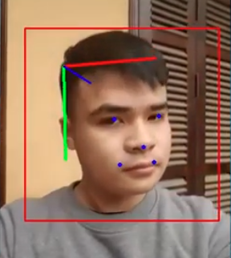

# Deep Head Pose 2 - Keras Tensorflow 2



## I. Introduction

- This repository contains an implementation of [Deep Head Pose](https://arxiv.org/pdf/1710.00925v5.pdf) based on original code from [Oreobird/tf-keras-deep-head-pose](https://github.com/Oreobird/tf-keras-deep-head-pose) with following changes:
    + Use [ShuffleNetV2](https://arxiv.org/abs/1807.11164) or [EfficientNet-B0](https://arxiv.org/abs/1905.11946) as backbone network. 
    The ideal of using ShuffleNetV2 comes from [this Pytorch implementation](https://github.com/OverEuro/deep-head-pose-lite).
    + Rewrite data generator for multi-threading.
    + Add 5-point landmark as an output branch.
    + Support 3 datasets: BIWI, AFLW2000, 300W_LP. 
        + All datasets are converted to uniform format (png files for images and JSON files for labels).
        + Use [Retina Face](https://github.com/deepinsight/insightface) for generating bounding box and landmark label automatically for BIWI dataset.
        + Re-label landmark points for AFLW2000. The final dataset can be downloaded from [here](https://drive.google.com/open?id=1XJXl0rmJ4gDqA8ZFLsSa-Ettbx4zjS26).
    + Write image augmentation code using multiple methods: blur, crop, add padding, sharpen, dropout, flip, adjust color and constrast...

- The original Pytorch version: https://github.com/natanielruiz/deep-head-pose

- Pretrained model for:
    + ShuffleNet V2: <models/shufflenet_v2.h5>.
    + EfficientNet: <https://drive.google.com/open?id=1lZHkaaCO_GZU8F6Ag8PzTzMDmS0Ramv6>.

## I. Environment:

- We use Tensorflow 2.0.0.
- Install environment from `environment.yml` file using Anaconda and Miniconda and activate that environment.

## II. Dataset preparation

- 1. Download [300W_LP](http://www.cbsr.ia.ac.cn/users/xiangyuzhu/projects/3DDFA/main.htm), [BIWI](http://www.vision.ee.ethz.ch/en/datasets/) and [AFLW2000](http://cvlab.cse.msu.edu/lfw-and-aflw2000-datasets.html) datasets and put into `data/300W_LP`, `data/BIWI`, `data/AFLW2000` respectively.
- 2. Use following scripts to generate data from those datasets: `make_data_300W_LP.py`, `make_data_BIWI.py`, `make_data_AFLW2000.py`. You can download final AFLW2000 from [here](https://drive.google.com/open?id=1XJXl0rmJ4gDqA8ZFLsSa-Ettbx4zjS26).
- 3. Run  `sh split_data_set.sh` to split dataset. This script will take 2000 images from 300W_LP and 2000 images from BIWI dataset to build validation set at `data/val_set` and remaining parts of these dataset to build training set at `data/train_set`. We use AFLW2000 as testing set.

## III. Training and testing

### Training

- Modify config files at `config_shufflenetv2.json` and `config_efficientnet.json` to use for training and testing.

- Example of commands for training:

```
python train.py -c config_shufflenetv2.json
```

Or 

```
python train.py -c config_efficientnet.json
```

### Testing

```
python test.py -c config_shufflenetv2.json
```

Or 

```
python test.py -c config_efficientnet.json
```