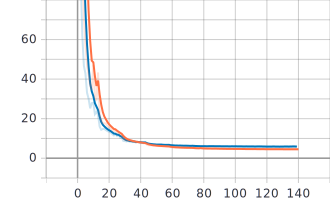

# Deep Head Pose - Keras Tensorflow 2.0

- This repository contains implementation of [Deep Head Pose](https://arxiv.org/pdf/1710.00925v5.pdf) based on original code from [Oreobird/tf-keras-deep-head-pose](https://github.com/Oreobird/tf-keras-deep-head-pose) with following changes:
    + Use [ShuffleNetV2](https://arxiv.org/abs/1807.11164) as backbone network. This idea comes from [this Pytorch implementation](https://github.com/OverEuro/deep-head-pose-lite).
    + Rewrite data generator for multithreading.
    + Add 5-point landmark as an output branch.
    + Use [Retina Face](https://github.com/deepinsight/insightface) to generate bounding box and landmark label automatically.

- **Result:**
    + Yaw MAE: 8.835566793169294
    + Pitch MAE: 9.442807577094253
    + Roll MAE: 10.96312210511188
    + Landmark MAE: 0.7686509973820604
    + Avg. FPS: **82** on CPU i5 9400

- **Total loss (from tensorboard):**
    + **Orange**: Train, **Blue**: Validation
    

- The original Pytorch version: https://github.com/natanielruiz/deep-head-pose